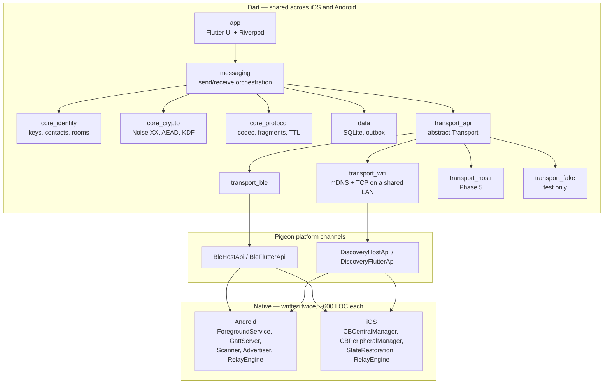

# Relay — Architecture

**Status:** Design, pre-implementation
**Companion documents:** [PLANNING.md](PLANNING.md), [brand](../brand/README.md), [SECURITY.md](SECURITY.md)

> **Two naming conventions worth knowing before reading any code.**
>
> The app is called Relay, and the brand name is deliberately absent from the
> identifiers. "Relay" was already a term of art here — Nostr relays, the BLE
> `RelayEngine`, `allowRelay`, TTL relay decisions, 459 uses before the product
> took the name — so types are named for what they do: `MeshRuntime`,
> `MeshIdentity`, `LocalStore`, `AppColors`, `AppTextScale`. The one exception
> is `RelayMark`, the logo.
>
> Five constants are domain separators: `relay-addr-v1`, `relay-safety-v1`,
> `relay-room-v1`, `relay-roomid-v1`, `relay-courier-tag-v1`. **They are
> frozen.** Each is hashed into a user-visible identity, so editing one silently
> changes every address and safety number in existence — which is
> indistinguishable from an attack. `app/test/brand_test.dart` fails if one
> moves. See [PLANNING.md](PLANNING.md) Phase 6d.

---

## 1. System overview

Relay is a Flutter application over a native Bluetooth Low Energy mesh transport. Roughly 65% of the code is shared Dart; the remaining 35% is a deliberately small native layer per platform that owns the radio and keeps relaying while the app is closed.



`transport_api` also holds `CompositeTransport`, which presents Bluetooth and
Wi-Fi to everything above as a single mesh. Peer ids are tagged with the
transport they arrived on — `ble/AA:BB`, `wifi/wifi:0000beef` — so a reply goes
back the way it came without the message layer knowing there is more than one
radio.

### Layer responsibilities

| Layer | Owns | Never does |
|---|---|---|
| `app` | Rendering, navigation, user intent | Crypto, packet construction, I/O |
| `messaging` | Orchestrating a send or receive end to end | Rendering, radio control |
| `core_protocol` | Byte-level encode/decode, fragmentation, TTL rules | I/O of any kind, crypto |
| `core_crypto` | Handshakes, encryption, key derivation | Storage, networking |
| `core_identity` | Key lifecycle, contact pinning, room derivation | Encryption primitives |
| `data` | Persistence, outbox, message state | Business rules |
| `transport_*` | Moving opaque frames between devices | Understanding frame contents |
| Native | Radio, background survival, opaque relay | Decrypting, understanding messages |

**Design rule:** `core_protocol` and `core_crypto` are pure. No file system, no network, no platform channels, no clock reads except through an injected clock. This makes the two most correctness-critical modules fully unit-testable and deterministic.

---

## 2. Repository layout

A Dart monorepo using native pub workspaces (Dart 3.6+). Each package has its own tests and can be reasoned about in isolation.

```
relay/
├── pubspec.yaml                    # workspace root
├── analysis_options.yaml           # one lint config for every package
├── README.md
├── CONTRIBUTING.md
├── CHANGELOG.md
├── .editorconfig
├── .github/
│   ├── workflows/ci.yml
│   ├── ISSUE_TEMPLATE/
│   ├── PULL_REQUEST_TEMPLATE.md
│   └── SECURITY.md                 # pointer; the real one is docs/SECURITY.md
├── docs/
│   ├── ARCHITECTURE.md             # how it works
│   ├── PLANNING.md                 # what was built, phase by phase
│   ├── SECURITY.md                 # threat model and review brief
│   ├── RELEASE.md                  # what must be true before shipping
│   └── FIELD-TEST.md               # running a real-world test
├── brand/                          # source artwork and the brand rules
├── packages/
│   ├── core_protocol/              # pure Dart: frames, fragments, TTL, relay rules
│   ├── core_crypto/                # pure Dart: Noise, BLAKE2s, ChaCha20
│   ├── core_identity/              # keys, contact pinning, room derivation
│   ├── transport_api/              # abstract interfaces + CompositeTransport
│   ├── transport_ble/              # Dart side + Pigeon-generated bindings
│   ├── transport_wifi/             # local network: mDNS discovery, TCP links
│   ├── transport_nostr/            # internet relay of last resort
│   ├── transport_fake/             # deterministic N-node mesh simulator
│   ├── data/                       # SQLite schema, outbox, message state
│   └── messaging/                  # orchestration
├── app/                            # Flutter application
│   ├── lib/
│   │   ├── main.dart               # entry point
│   │   ├── relay_app.dart          # public library barrel
│   │   └── src/
│   │       ├── app/                # composition root: bootstrap and wiring
│   │       ├── domain/             # pure data and pure functions, no Flutter
│   │       ├── runtime/            # the live parts: engine, state, log, audio
│   │       └── ui/                 # everything that imports material.dart
│   │           └── screens/
│   ├── test/
│   │   └── support/                # shared fixtures, not tests themselves
│   ├── android/
│   │   └── app/src/main/kotlin/dev/kishorek/relay/
│   │       ├── ble/                # Kotlin: service, GATT, RelayEngine
│   │       └── wifi/               # Kotlin: NSD discovery
│   └── ios/
│       ├── Runner/Ble/             # Swift: managers, RelayEngine
│       └── Runner/Wifi/            # Swift: Bonjour discovery
├── testvectors/                    # shared JSON, consumed by Dart + Kotlin + Swift
│   ├── protocol/
│   ├── crypto/
│   ├── power/
│   ├── relay/
│   └── nostr/                      # vendored from the NIP-44 spec, not ours to regenerate
└── tools/
    ├── generate_vectors.dart       # writes testvectors/relay and /crypto
    └── parity/                     # standalone runners proving native matches Dart
        ├── kotlin/{relay,power}/
        └── swift/{relay,power}/
```

### Why `app/lib/src` is split four ways

The split is by *what a file is allowed to depend on*, not by feature:

| Directory | May import | Exists to |
|---|---|---|
| `domain/` | Dart and the core packages — **never** `material.dart` | Hold data and pure functions testable without a widget tester |
| `runtime/` | `domain/`, the transport and messaging packages | Hold the moving parts: `MeshRuntime`, observable state, the event log, audio |
| `ui/` | `domain/`, `runtime/`, Flutter | Draw things and turn taps into intent |
| `app/` | everything | Wire the above together once, at startup |

The arrows point one way. A file in `domain/` that reaches for a widget, or a
screen that opens a transport directly, is the shape of the mistake this layout
is meant to make obvious in a diff.

Intra-library imports are written `package:relay_app/src/...` rather than
relative. Across four directories a relative import reads
`../../domain/models.dart`, which says nothing about which layer it crosses
into; the package form names the layer and survives the next move.

Parity harnesses live under `tools/`, never inside `app/`. The Swift one used
to sit in `app/ios/Runner/Ble/` and be copied out by CI — a file with top-level
code inside the app's own source tree, one careless "add to target" away from
breaking the build.

---

## 3. Wire protocol v1

### 3.1 Frame header

Fixed 20 bytes, big-endian, followed by the payload. Sized to leave useful payload room inside a conservative 185-byte BLE ATT MTU.

| Offset | Size | Field | Notes |
|---|---|---|---|
| 0 | 1 | `version` | `0x01`. Receivers drop unknown major versions silently. |
| 1 | 1 | `type` | See frame types below |
| 2 | 1 | `ttl` | Starts at 7, decremented per relay, dropped at 0 |
| 3 | 1 | `flags` | Bit 0 encrypted, 1 fragmented, 2 compressed, 3 urgent, 4–7 reserved |
| 4 | 8 | `msgId` | Cryptographically random. Identifies one *transmission*; combined with the fragment index to form the dedup key. |
| 12 | 4 | `srcHash` | Truncated hash of sender's session public key |
| 16 | 4 | `dstHash` | `0x00000000` means broadcast |
| 20 | n | `payload` | Encrypted unless flag 0 is clear |

`srcHash` and `dstHash` are truncated to 4 bytes deliberately. They are routing hints, not identities — collisions are expected and harmless, because the real recipient check is whether decryption succeeds. Truncation means an observer cannot enumerate participants from traffic alone.

### 3.1a Announce

The only frame this app sends in the clear, and therefore the only one whose
contents are a decision rather than a convenience. It carries a nickname and two
public keys — Ed25519 for identity, X25519 for Noise — a signature over all
three, and no secret.

```
[0]              nickname length in bytes
[1 .. 1+n]       nickname, UTF-8, truncated on a grapheme boundary
[1+n .. +32]     Ed25519 identity public key
[1+n+32 .. +32]  X25519 Noise static public key            (optional)
[1+n+64 .. +64]  Ed25519 signature over everything above   (optional)
```

At the longest nickname that is 161 bytes against a 165-byte payload budget. A
further field does not fit: adding one means fragmenting the announce, and a
fragmented announce is one a device can half-hear.

Parsed by **length**, never by "the rest of the payload". A build that has
learned a new field must stay readable by one that has not: a device that cannot
parse an announce cannot see the person sending it, and there is no second
channel to fall back to. An announce from before couriers — 32 trailing bytes
instead of 64 — still parses, with no Noise key.

**The signature is what makes any of it believable.** Every field here is acted
on: the nickname names a conversation, the identity key decides whether somebody
is trusted enough to be handed other people's mail (§3.6c), and the X25519 key
is what a courier envelope is sealed to. Unsigned, all three are assertions by
whoever is holding a radio — and the X25519 key is the dangerous one, because an
identity key is *public*. Anyone in range could rebroadcast somebody's identity
key beside their own X25519 key and have that person's mail sealed to them.
Pinning the contact does not help: verification covers the identity key, and
nothing else binds the Noise key to it.

So a receiver sorts an announce three ways, in
`app/lib/src/domain/announce_trust.dart`:

| Outcome | Meaning | What is believed |
|---|---|---|
| `signed` | Verifies against the identity key it claims | Everything |
| `unsigned` | No signature field | Only that *a* device is in range |
| `forged` | A signature that does not verify | Nothing; the frame is dropped |

`unsigned` is tolerated rather than dropped because it is not hostile — a build
that predates the field, or another program on the same radio — but nothing it
claims is attributable, so nothing it claims is stored.

**One builder, two senders.** Dart broadcasts this frame directly; native
rebroadcasts the identical bytes on its own timer, because Dart is not alive in
the background and a beacon that stops when the app closes is not a beacon.
Native is handed the already-truncated nickname and an opaque blob — the two
keys and the signature — and appends it verbatim. It deliberately cannot
construct the payload: the signing key never leaves Dart, and a second
implementation of this format is exactly how the two sides drift apart. They did
drift, once: native was handed the identity key alone, so the periodic beacon —
the only announce a peer met later ever hears — published no Noise key, and
couriering almost never worked.

The X25519 key is public by construction; every Noise handshake already reveals
it to whoever this device speaks to. Publishing it in an announce gives away
nothing that talking does not, and it is what makes couriering (§3.6c) possible
at all.

### 3.2 Frame types

| Value | Type | Encrypted | Purpose |
|---|---|---|---|
| `0x01` | `ANNOUNCE` | No | Periodic presence beacon: session key, nickname, capability flags |
| `0x02` | `HANDSHAKE` | Noise | Noise XX message 1/2/3 |
| `0x03` | `MESSAGE` | Yes | Chat payload |
| `0x04` | `ACK` | Yes | Delivery or read receipt |
| `0x05` | `FRAGMENT` | Yes | One piece of a larger payload |
| `0x06` | `ROOM` | Room key | Group room message |
| `0x07` | `VOICE` | Yes | Voice note, always fragmented |
| `0x08` | `LEAVE` | No | Graceful departure hint, lets peers drop presence early |
| `0x09` | `HISTORY_REQUEST` | Room key | "I just joined — what did I miss?" |
| `0x0A` | `HISTORY_REPLY` | Room key | Up to 100 messages / 8 KB from the last 12 hours |
| `0x0B` | `ROOM_CONTROL` | Room key | Signed owner claim, transfer, or retention setting |
| `0x0C` | `BATCH` | Yes | Several queued messages to one person in one frame |
| `0x0D` | `COURIER` | Sealed body | One envelope for somebody not here. Always `ttl: 1` |

**Every type has to exist in three places** — Dart, `RelayEngine.kt` and
`RelayEngine.swift` — because both native relays *drop* a frame whose type they
do not recognise. A type added in Dart alone does not degrade gracefully; it
stops dead at the first hop through that platform, on real hardware, which is
the most expensive place to discover it. `app/test/native_parity_test.dart`
reads the two native sources and fails if any Dart type is missing from either.

### 3.3 Fragmentation

Any payload exceeding `maxPayloadLength` (165 bytes) is split into 160-byte bodies. Each fragment carries a 5-byte sub-header inside the payload region:

| Size | Field |
|---|---|
| 2 | `fragIndex` |
| 2 | `fragTotal` |
| 1 | `originalType` |

`originalType` is required: once a frame is retyped as `FRAGMENT`, the destination has no other way to know what it is rebuilding.

All fragments of one logical message share the same `msgId` so the destination can group them. **Deduplication therefore cannot key on `msgId` alone** — see section 3.5.

**Reassembly buffer limits:** 64 concurrent partial messages, 2 MB total, 120-second expiry per message. Exceeding any limit evicts the oldest partial. These bounds are mandatory — an unbounded reassembly buffer is a trivial memory-exhaustion vector for any nearby device.

A 30-second Opus voice note at 8 kbit/s is roughly 30 KB, which is about 190 fragments. That is acceptable direct or at one hop, and is deliberately marked non-urgent so text always wins contention.

### 3.4 Compression, padding and batching

Three transformations sit between a message and the wire, in this order, and the
order is load-bearing:

1. **LZ4**, on payloads above 128 bytes, kept only if it actually shrinks them.
   Pure Dart (`core_protocol/lib/src/lz4.dart`) so the package keeps no native
   dependency. The marker lives **inside** the encrypted envelope, not in the
   header's spare `compressed` flag: setting that would tell every relay in
   earshot which messages were repetitive enough to shrink.
2. **Batching**, when several messages are queued for the same person. They
   travel as one `BATCH` frame and are acknowledged by one receipt that cascades
   backwards over earlier sequences to the same recipient. Rooms are never
   batched — a room message is already one frame to everybody.
3. **Padding**, to 64/128/256/… byte blocks with random filler, so frame length
   stops describing message length.

Compress before padding, never after: the other order compresses the filler away
and restores exactly the signal padding removes. Pad before encrypting, never
after: padding ciphertext leaves the real length visible in the block the
receiver has to be told about.

Cover traffic (`core_protocol/lib/src/cover_traffic.dart`) is a fourth,
optional layer: a random delay before each real send, plus occasional dummy
frames marked inside the envelope and dropped silently by the recipient. Off by
default — it costs battery and airtime and buys only partial protection.

### 3.5 Relay algorithm

Runs natively. Never decrypts.

```
on frame received:
    if version unsupported:          drop
    if srcHash == myHash:            drop            # our own echo
    key = (msgId, fragmentIndex)                     # -1 when not fragmented
    if key in seenSet:               drop            # deduplication
    add key to seenSet
    if dstHash == myHash or dstHash == BROADCAST:
        persist for delivery to Dart
    if ttl == 0:                     stop
    if dstHash == myHash:            stop            # terminal, do not relay
    ttl -= 1
    wait random(20ms, 150ms)                         # collision jitter
    if msgId seen from >= 2 other peers during wait:
        drop                                         # suppression: already well covered
    broadcast to all connected peers except origin
```

**Deduplication key.** The key is `(msgId, fragmentIndex)`, not `msgId`. Keying on `msgId` alone discards every fragment after the first, so no multi-fragment message ever crosses a relay. This was caught by the mesh simulator in Phase 0 and is covered by the shared relay vectors `second-fragment-of-known-message-still-relays` and `repeat-of-same-fragment-drops`.

**Deduplication set:** LRU, 2000 entries, 10-minute expiry, persisted across process restarts so a service restart does not cause a rebroadcast storm. A repeated id deliberately does *not* refresh its position in the table, or a peer flooding one id could pin the table and evict everything else.

**Retries use a fresh `msgId`.** A retry of the same logical message is a new transmission: reusing the old `msgId` would be dropped instantly by every relay that already saw it, so it could never reach a newly-available path. End-to-end duplicate suppression is consequently the application layer's job, keyed on the sender identity plus an application sequence number carried inside the encrypted payload — never on `msgId`.

**Jitter and suppression** together prevent the broadcast storm that naively flooding a dense crowd would produce. In a 60-device cluster, naive flooding of one message produces ~3600 transmissions; suppression cuts this by roughly an order of magnitude.

### 3.6a Room catch-up

Joining a room broadcasts a `HISTORY_REQUEST` encrypted with the room key.
Members wait a random moment up to 1.2 s before answering and cancel their own
reply if they hear someone else's, so twenty phones do not all send the same
back catalogue at once. A member answers at most once a minute per room.

The reply is bounded twice, by count (100) and by bytes (8 KB), because both
limits are reachable by asking politely. Entries are deduplicated on the
receiving side against the same `(sender, sequence)` table that suppresses a
message arriving over two radios, and they do not count as unread — they predate
the reader entirely.

### 3.6b Room ownership

`ROOM_CONTROL` carries an Ed25519-signed claim, transfer or retention setting.
First claim wins; a transfer or retention change is accepted only from the
current owner; a claim older than the one already held is ignored, so a captured
claim cannot be replayed as a newer one.

All of it is **advisory**. The room's only real access control is its code. What
the signature buys is that nobody can forge a claim in somebody else's name and
that a transfer cannot be redirected in flight — the new owner is inside the
signed bytes. See `docs/SECURITY.md` §2.

### 3.6c Couriers

Store-and-forward by strangers, as distinct from §3.6, which is this device
holding its own outgoing mail.

`CourierEnvelope` is a TLV blob: a 16-byte rotating recipient tag, an expiry, an
opaque ciphertext, and an optional spray budget. TLV so an unknown field from a
newer build is skipped rather than fatal — a courier that refused to carry what
it did not understand would stop being useful the first time the format grew.

- **Seal** — `NoiseX` in `core_crypto`, the one-message pattern `-> e, es, s,
  ss`. The sender may be gone before delivery, so there is no handshake to
  complete; their identity rides encrypted inside.
- **Tag** — `HMAC-BLAKE2s(recipient static key, "relay-courier-tag-v1" ‖ UTC
  day)`, truncated to 16 bytes. Computable only by somebody who already knows
  the recipient. Yesterday and tomorrow are both matched.
- **Spray and wait** — a budget of at most 8, halved on each handover to another
  courier. `CourierStore` commits the reduced budget only *after* the other
  device accepts, because a mesh is mostly failed connections, and refuses to
  refill a budget from a replayed deposit.
- **Quotas** — 40 envelopes, of which 20 may be from merely-verified
  depositors; 5 per favourite, 2 per verified. Eviction is oldest-first and
  sheds verified mail before a favourite's.

**On the wire.** `FrameType.courier` (0x0D) carries exactly one envelope, always
with `ttl: 1` and never over the relay. Flooding would be wrong twice over: a
mesh that can reach the recipient has no need of a courier, and relaying would
replicate the envelope outside the spray budget, which is the only thing
bounding how much of the network one message consumes. The frame's `encrypted`
flag is **false**, honestly — the body is sealed, but the tag, expiry and copy
count are readable so a carrier can decide whether to take it and when to drop
it.

**The encounter rule.** Every announce triggers `MeshRuntime.offerMail`:

1. **Deliver** everything whose tag matches the peer's, then forget it — but
   only once the transport has accepted it. Forgetting on the attempt would drop
   mail on a dropped connection, which is exactly when carrying it mattered.
2. **Spray**, but only to a favourite or a verified contact. Handing envelopes
   to any passer-by would tell them this device is carrying traffic and roughly
   for whom.

Delivery runs before spraying, so meeting the recipient never costs a copy.
Neither happens in stealth mode: handing mail over is transmitting.

**Origination.** `depositWithCouriers` seals an `AppEnvelope` — the same
container a radio message uses, so a message arriving by both paths is
deduplicated against itself by the same `(sender, sequence)` table — and offers
it to every trusted carrier present. It returns how many took it; zero is
ordinary, and the outbox keeps retrying in parallel regardless.

**Prerequisite: the announce publishes an X25519 key.** Mail is sealed to a
Noise static key, and before this nothing transmitted one, so nothing could be
sealed. `Announce` (§3.1a) now carries it and the store keeps it against the
contact. Two consequences worth stating: a peer who has never announced cannot
be couriered to at all, and a delivered envelope whose sender this device has
never heard announce is **dropped** rather than shown, because attributing a
message to nobody is worse than not showing it.

### 3.7 Location channels

`Geohash` is a straight base32 geohash — ported rather than invented, because a
channel only works if every client derives the same cell name from the same
coordinate. `GeohashChannel` exposes six levels from building (8 characters) to
region (2), which nest: the block is inside the city.

### 3.6 Store and forward

Frames addressed to a peer that is currently unreachable are held in a native queue: 500 frames or 4 MB, whichever comes first, 24-hour expiry, evicting oldest first. When that peer appears, queued frames are delivered before new traffic.

---

## 4. Cryptography

All primitives come from vetted libraries. Nothing is hand-rolled except the Noise XX state machine, which is implemented directly against the specification's published test vectors.

| Purpose | Primitive |
|---|---|
| Long-term identity | Ed25519 |
| Key agreement | X25519 |
| Session encryption | ChaCha20-Poly1305 |
| Handshake | Noise Protocol Framework, XX pattern |
| Hashing | BLAKE2s |
| Room key derivation | Argon2id |

**Dart:** `cryptography` package for X25519, Ed25519, ChaCha20-Poly1305, BLAKE2s and Argon2id.

> **Do not use `Hmac(Blake2s())` from that package for Noise.** It reports `Blake2s.blockLengthInBytes == 32`, which is the digest size, not the 64-byte block size RFC 7693 specifies. The resulting MAC is not HMAC-BLAKE2s, and since Noise's HKDF is built entirely on HMAC, a handshake would still succeed between two of our own devices while failing every official vector and losing its security proofs. `core_crypto` implements HMAC-BLAKE2s directly and pins it with known-answer tests.

### 4.1 Identity

An Ed25519 keypair is generated on first launch and stored in the platform keystore — Android Keystore with `StrongBox` when available, iOS Keychain with `kSecAttrAccessibleWhenUnlockedThisDeviceOnly`. The private key never leaves secure storage and is never backed up.

A separate ephemeral X25519 session keypair is generated per app session and is what `srcHash` is derived from. Strangers therefore cannot correlate a device across sessions. Pinned contacts receive the session key signed by the long-term identity key inside `ANNOUNCE`, so they can still resolve you.

### 4.2 Direct message sessions

Noise XX provides mutual authentication and forward secrecy. Handshake completes in three messages, then both sides hold separate send and receive cipher states.

**Nonces are transmitted, not implied.** This is a deliberate departure from the Noise spec's transport phase and the single most important protocol decision made during implementation.

Noise advances an implicit counter in lockstep on both sides. That is correct over an ordered, reliable transport. Over BLE it is not: frames are lost and reordered as a matter of course, and the first loss leaves the receiver permanently one step behind the sender, after which *every* subsequent message fails to authenticate — forever, with no recovery short of a new handshake. The mesh path therefore prefixes each ciphertext with its 8-byte nonce and applies a 64-entry sliding replay window on receipt. A nonce already accepted, or older than the window, is rejected; the window is updated only after authentication succeeds, so a forged frame cannot burn a nonce the genuine message still needs.

The spec-conformant implicit-counter path is retained and is what the published cacophony vectors are verified against. `NoiseSession` exposes both: `encrypt`/`decrypt` for the conformant path, `seal`/`open` for the mesh.

Automatic rekeying applies **only** to the conformant path. Count-triggered rekeying cannot work on the framed path for exactly the reason above — the two sides' counts diverge the moment a frame is lost. The framed path keeps one key per direction for the life of the session and bounds exposure by tearing the session down when the peer goes away, rather than by rotating within it. This is a real reduction in intra-session forward secrecy and is stated here rather than buried.

**A handshake is never bypassed.** `SessionManager.encrypt` throws when no session exists; `MessageService` responds by opening a handshake and leaving the message in the outbox. There is no code path that falls back to plaintext, because a message going out readable while the UI shows a lock would be the worst failure this app could have.

**Simultaneous opens are resolved by address hash.** Two strangers in a crowd reach for each other at the same instant constantly. Without a rule both sides sit as initiators waiting for a responder that never arrives. The lower address hash yields and becomes the responder; the other ignores the competing opening. The rule uses only data both sides already hold and gives opposite answers on the two devices.

### 4.3 Group rooms

```
roomSalt = BLAKE2s("relay-room-v1" || uppercase(code))
roomKey  = Argon2id(password = uppercase(code), salt = roomSalt,
                    m = 64 MiB, t = 3, p = 1, outLen = 32)
roomId   = BLAKE2s(roomKey)[0..4]
```

Argon2id parameters are tuned so deriving one room key takes roughly half a second on a mid-range phone, making offline brute force of the code space expensive rather than trivial.

Room messages are sealed with ChaCha20-Poly1305 under a **random** per-message nonce, prefixed to the ciphertext. Random rather than a counter because a room has no single sender to own a sequence: every member encrypts under the same key, and two members picking the same counter would destroy confidentiality for both messages. Replay of a room message is caught above the crypto layer, by the `(senderKey, sequence)` deduplication in `data`.

**This is deliberately documented as weak.** A six-character alphanumeric code is about 31 bits of entropy. Argon2id raises the cost of a guessing attack but does not eliminate it, and anyone who legitimately learns the code reads the room forever. Room messages therefore have **no forward secrecy**.

The join screen must state, in plain language, that anyone with the code can read the room. Do not display a lock icon on room chats that implies the same guarantee as a direct message.

Room codes are 6 characters from a 32-character alphabet excluding visually ambiguous glyphs (`0`, `O`, `1`, `I`, `L`).

### 4.4 Contact verification

A contact QR encodes `relay:1:<identity>:<noise>:<nostr>:<nickname>` — the long-term Ed25519 key that gets pinned, the X25519 static key so a first handshake can be checked against what was scanned rather than trusted blindly, an optional secp256k1 key for the internet relay, and a display nickname. Keys are base64url; the nickname is encoded rather than embedded raw because the separator is a colon and names contain anything. Anything that is not one of our codes decodes to null rather than throwing: a camera pointed at the world sees other QR codes constantly, and that is not an error condition. Scanning pins the key. A **safety code** derived from both identity keys is shown on each device for out-of-band comparison: 60 digits in 12 groups of five, produced by iterated hashing so forging a collision costs the full work factor.

> **Changed from the original spec**, which called for a 6-word phrase. A word phrase is easier to read aloud in a loud crowd, but needs a vetted, localised 2048-entry word list that does not yet exist for this project; shipping an improvised one would be worse than digits. `SafetyCode` is the seam — a word encoding can replace the digit rendering later without touching the derivation.

If a pinned contact ever presents a different long-term key, the app shows a blocking warning and requires explicit re-verification. It does not silently accept the new key.

### 4.5 Stealth Mode

A single toggle that changes transport and presence behaviour:

- Stop BLE advertising; operate scan-only
- Suppress `ANNOUNCE` broadcasts and nickname disclosure
- Disable the internet relay transport entirely
- Continue relaying others' traffic (this is what protects the user — being a relay is cover)
- Arm panic wipe: a triple tap purges keystore entries, the database, and the native packet store, then terminates

Panic wipe is destructive and irreversible by design. It must be confirmed once during onboarding, not at the moment of use.

---

## 5. Platform channel contract

Generated with **Pigeon** so both sides are type-safe and drift between Dart and native signatures becomes a compile error.

The contract is deliberately narrow. Native exposes a byte pipe and peer events, nothing more.

```dart
// pigeons/ble_api.dart

class PeerInfo {
  String peerId;        // stable for the duration of a session
  int rssi;
  int hopDistance;      // 1 = direct connection
  bool isDirect;
  int lastSeenMillis;
}

class TransportStatus {
  bool adapterOn;
  bool permissionsGranted;
  bool advertising;
  bool scanning;
  int connectedPeerCount;
  String powerMode;     // "performance" | "balanced" | "saver"
}

@HostApi()
abstract class BleHostApi {
  void start(Uint8List sessionKeyHash, String powerMode);
  void stop();
  void sendFrame(Uint8List frame, String? targetPeerId);  // null = broadcast
  List<PeerInfo> getPeers();
  TransportStatus getStatus();
  List<Uint8List> drainInbox();   // frames received while Dart was not running
  void setPowerMode(String mode);
  void setStealthMode(bool enabled);
  void wipe();
}

@FlutterApi()
abstract class BleFlutterApi {
  void onFrameReceived(Uint8List frame, String fromPeerId);
  void onPeerDiscovered(PeerInfo peer);
  void onPeerLost(String peerId);
  void onStatusChanged(TransportStatus status);
}
```

`drainInbox` is what makes the closed-app case work: native persists frames addressed to this device while Dart is dead, and Dart pulls them on next launch.

### 5.1 Discovery channel

A second, much narrower contract (`pigeons/discovery_api.dart`). Native does
mDNS and nothing else; the sockets are pure Dart, because `dart:io` speaks TCP
identically on both platforms and there is no reason to write that twice.

```dart
@HostApi()
abstract class DiscoveryHostApi {
  bool isAvailable();
  DiscoveryUnavailable? unavailableReason();  // permissionDenied | noNetwork
  @async void advertise(String instanceId, int addressHash, int port);
  @async void stopAdvertising();
  @async void browse();
  @async void stopBrowsing();
}
```

---

## 5.2 Local-network transport

Bluetooth is the transport that works anywhere. Wi-Fi is the one that works
*well* — where it works at all.

The case it exists for is a router with the internet unplugged, or an old phone
running a hotspot with mobile data off. Everyone joined to it reaches everyone
else in one hop, at roughly a hundred times Bluetooth's throughput and a
fraction of the battery, because nothing has to scan.

| | Bluetooth mesh | Local network |
|---|---|---|
| Works with no infrastructure | Yes | No — needs a shared Wi-Fi |
| Range | ~10–30 m per hop, multi-hop | Whatever the router covers, one hop |
| Throughput | Kilobits | Megabits |
| Survives backgrounding | Yes, both platforms | Android partly, iOS no |
| Who can see traffic exists | Anyone with a radio nearby | Everyone on the network, and its owner |

**Discovery.** mDNS, service type `_kishorek-relay._tcp`, TXT carrying a per-run instance
id and the truncated mesh address. Not a UDP broadcast beacon: since iOS 14,
multicast and broadcast need an entitlement Apple grants by application, while
Bonjour needs only a usage string. Android's `NsdManager` speaks the same
protocol, so one mechanism covers both with no approval process.

**Links.** One TCP connection per peer, length-prefixed frames, 64 KiB cap. The
first message each way is a hello carrying the sender's address hash, which is
what lets both ends resolve the case below.

**Simultaneous dial.** Two devices discovering each other at the same instant is
the normal case, not a race: both dial, and one of the two connections must go.
The rule is *keep the connection opened by the lower address hash* — computable
identically on both sides from the hello, so they never disagree. Getting this
wrong means each side keeps the socket the other just closed and nothing is
delivered in either direction.

**Peer ids** are derived from the mesh address (`wifi:0000beef`), not the
socket, so they survive a reconnect. A peer id that changed whenever a phone
slept would fork the conversation every time.

**Encryption is unchanged.** The transport carries the same opaque frames the
radio does, and the Noise session sits on top exactly as before. The router's
owner sees encrypted bytes, the same as a relaying phone does. What they
additionally learn is that two particular devices are talking, and when — which
is stated in the app's own threat model rather than left to be discovered.

---

## 6. Native layer

### 6.1 Android

```
ble/
├── MeshForegroundService.kt   # android:foregroundServiceType="connectedDevice"
├── GattServerController.kt    # peripheral role: serve characteristic, notify
├── GattClientController.kt    # central role: connect, subscribe, write
├── Advertiser.kt              # BLE advertising with service UUID
├── Scanner.kt                 # duty-cycled scanning
├── RelayEngine.kt             # dedup, TTL, jitter, suppression
├── PacketStore.kt             # Room DB: inbox + store-and-forward queue
└── PowerPolicy.kt             # scan/advertise duty cycle per power mode
```

Both roles run concurrently: the device advertises and serves a GATT characteristic while also scanning for and connecting to others. One custom 128-bit service UUID, one write-without-response characteristic for outbound, one notify characteristic for inbound.

**Constraints to design around:**
- `BLUETOOTH_SCAN`, `BLUETOOTH_ADVERTISE`, `BLUETOOTH_CONNECT` are runtime permissions on Android 12+. `BLUETOOTH_SCAN` carries `usesPermissionFlags="neverForLocation"` so location permission is not required.
- Foreground service type `connectedDevice`, with a persistent, honest notification showing peer count and power mode.
- GATT server connection limits vary by chipset; assume a practical ceiling of 6 simultaneous connections and rotate.
- Some chipsets do not support peripheral mode at all. Detect via `BluetoothAdapter.isMultipleAdvertisementSupported()` and degrade to central-only, with the UI stating the device can receive and relay but not be discovered.
- OEM battery managers on Xiaomi, Oppo, Vivo, Huawei, and Samsung kill foreground services regardless of correctness. Onboarding deep-links to the relevant settings screens per manufacturer.

### 6.2 iOS

```
Ble/
├── MeshManager.swift          # lifecycle, restoration entry point
├── CentralController.swift    # CBCentralManager
├── PeripheralController.swift # CBPeripheralManager
├── RelayEngine.swift          # identical semantics to RelayEngine.kt
├── PacketStore.swift          # Core Data / SQLite
└── PowerPolicy.swift
```

Background operation requires `UIBackgroundModes` containing `bluetooth-central` and `bluetooth-peripheral`, plus State Preservation and Restoration on both managers with stable restoration identifiers. iOS relaunches the app into the background on Bluetooth events, entering Swift directly — the Flutter engine is not necessarily running, which is precisely why `RelayEngine` is native.

**Constraints to design around:**
- A backgrounded iOS app moves its service UUID into the advertising *overflow* area. That area is only readable by another iOS device explicitly scanning for that exact UUID. **A backgrounded iPhone is effectively invisible to Android scanners.** This is an Apple platform limitation shared by every mesh app including bitchat, and it cannot be engineered away.
- The local name is not advertised in the background.
- Scanning in the background is throttled and coalesced; discovery latency rises substantially.

Phase 1.5 exists to measure exactly how bad this is before committing to Phase 4's design.

### 6.3 Relay parity

`RelayEngine.kt` and `RelayEngine.swift` are the only meaningful duplicated logic. To keep them from diverging:

- Both are capped at roughly 600 lines and contain no UI or platform-specific concerns beyond their radio callbacks.
- `testvectors/relay/*.json` describes input frames, existing dedup state, and expected outputs including TTL and drop decisions.
- Kotlin and Swift test suites both consume those vectors in CI. A divergence fails the build.
- Any change to relay semantics changes the vectors first, then both implementations.
- The `FrameType` table is duplicated a third time, in Dart. Both native relays
  drop unrecognised types, so `app/test/native_parity_test.dart` reads the two
  native sources as text and fails when a Dart type is missing from either. It
  is a crude check and it is the difference between catching that in a second
  and catching it in a field test.

---

## 7. Data model

Drift (SQLite) in the `data` package.

```
contacts       (id, pubkey, nickname, pinnedAt, safetyWords, trustState)
rooms          (id, code, roomKeyRef, name, joinedAt)
conversations  (id, kind[direct|room], peerOrRoomId, lastActivityAt, unreadCount)
messages       (id, msgId, conversationId, direction, type, body, mediaRef,
                createdAt, state, hopCount, transport)
outbox         (msgId, frames, targetHash, attempts, nextRetryAt, expiresAt)
peers_seen     (peerId, pubkey, lastSeenAt, lastRssi, hopDistance)
media          (id, path, mimeType, durationMs, sizeBytes)
```

`messages.state` is an enum: `queued`, `sent`, `delivered`, `read`, `failed`, `expired`.

The distinction between `sent` and `delivered` is load-bearing. `sent` means the frame left this device. `delivered` means an `ACK` came back. In a mesh these are genuinely different and the UI must not conflate them.

---

## 8. State management

Riverpod. Three long-lived providers back most of the UI:

- `transportStatusProvider` — adapter state, permissions, peer count, power mode
- `peersProvider` — live peer list, drives the presence strip and radar
- `conversationsProvider` — chat list with unread counts

Message streams are per-conversation and paginated. The UI never reads the transport or the database directly; everything routes through `messaging`.

---

## 8.1 Layout

`app/lib/src/ui/responsive.dart` holds the whole layout contract. Three widths,
Material's thresholds — used because they are the ones every other app on the
device already uses, so rotating a phone puts things where rotating anything
else puts them.

| Breakpoint | From | Shape |
|---|---|---|
| `compact` | 0 | Phone upright. One thing at a time. |
| `medium` | 600 | Phone on its side, small tablet. Roomier, still one column. |
| `expanded` | 840 | Large tablet, desktop window. Two panes. |

**Two panes need height as well as width**, which is the part a breakpoint
table alone gets wrong. A phone in landscape is 844 points wide — expanded by
any threshold — and 390 tall, of which a keyboard takes most. `Panes.twoIn`
therefore requires 840 wide *and* 600 tall.

Selection lives in `_AppShellState._selectedConversationId`, not on the
navigator, so it survives a rotation. `_reconcileLayout` runs after every frame
and pushes the conversation when the window narrows, pops it when the window
widens. Without it, turning a tablet upright mid-sentence loses the user's
place, and turning it back shows the conversation twice.

**`ReadableWidth`** caps a column of text at 720 points and does it with
`Padding`, not `Align` or `SizedBox`. Both alternatives were tried and both
broke something: an `Align` loosens the height constraint, and a scrolling
child given a loose height shrink-wraps to nothing — every control painted,
none tappable, screen looks normal. Forcing the height fixes that and makes a
`bottomNavigationBar` as tall as the window. Padding changes neither axis's
tightness. Both failures are pinned by tests in `app/test/responsive_test.dart`.

**`AppTextScale`** clamps the user's text setting to 1.6x, applied once in
`MaterialApp.builder` so a new route cannot forget it. Clamped rather than
ignored: accessibility settings are not a suggestion, but some platforms offer
3x and beyond, past which every screen is overflow stripes.

`app/test/overflow_test.dart` renders **every screen at four sizes** — smallest
phone, smallest phone at maximum text, phone landscape, large tablet — and
fails on any layout overflow, plus a self-check that the guard can fail. It
found four real defects on first run.

---

## 9. Error handling

| Condition | Behaviour |
|---|---|
| Bluetooth adapter off | Persistent banner with a one-tap enable action; queued messages held |
| Permissions denied | Blocking explainer screen with rationale and a settings deep link |
| Peripheral mode unsupported | Degrade to central-only; banner explains reduced discoverability |
| Platform channel dies | Dart reconnects with backoff; native relaying continues uninterrupted |
| Foreground service killed by OEM | Detect on next launch, prompt battery exemption, log to a diagnostics screen |
| Reassembly timeout | Partial discarded, sender receives no ack, outbox retries |
| Decrypt failure | Frame dropped silently, counted in diagnostics — never surfaced as an error to the user, since a decrypt failure is the expected result for traffic not meant for you |
| Outbox expiry | Message marked `expired` with a clear "never delivered" state in the UI |

Nothing in this table produces a crash or a silent success.

---

## 10. Testing strategy

**Pure unit tests** cover `core_protocol` and `core_crypto` completely: codec round-trips, malformed and truncated frames, adversarial fragment sequences, TTL boundaries, dedup expiry, handshake against specification vectors, nonce exhaustion.

**`transport_fake`** is the centrepiece. It simulates an N-node mesh in memory with configurable topology, packet loss, latency, and partition events. This makes mesh behaviour — flood suppression, store-and-forward, delivery under churn — testable in ordinary Dart unit tests with no hardware. Scenarios include a 20-node dense cluster, a chain topology at maximum TTL, a partition-and-heal cycle, and a node joining mid-conversation.

**Parity tests** run shared JSON vectors against Kotlin and Swift relay implementations.

**Widget tests** cover every degraded state: no permissions, adapter off, zero peers, peripheral unsupported, message failed, room joined with warning displayed.

**Manual device matrix**, tracked in `tools/meshlab/`: minimum three Android devices across two manufacturers plus two iPhones, exercising relay, background survival, and battery drain.

**Field test** at a real crowded venue with at least 10 users, gating v1 completion.

---

## 11. Threat model

**Defended against:**
- Passive eavesdropping on message content — end-to-end encryption on direct messages
- Impersonation of a verified contact — key pinning with safety phrase comparison
- Message tampering or replay — AEAD authentication, dedup by `msgId`
- Cross-session tracking by strangers — rotating session keys, truncated address hashes
- Retroactive decryption of past direct messages after key compromise — Noise XX forward secrecy and rekeying
- Memory exhaustion by a hostile nearby device — bounded reassembly, dedup, and store-and-forward buffers

**Not defended against, and stated plainly:**
- Traffic analysis by an observer with wide radio coverage. Timing and volume leak. No cover traffic in v1.
- Physical device seizure while unlocked. Panic wipe helps only if triggered.
- Anyone who obtains a room code. Room membership is unauthenticated by design.
- Radio jamming or denial of service. BLE has no defence available at the application layer.
- A malicious relay dropping traffic. Relays cannot read or forge messages, but they can decline to forward. Multi-path flooding mitigates this statistically; it is not a guarantee.
- Observation by whoever runs the Wi-Fi. When the local-network transport is in use, the network's owner can see which devices are talking to each other and when, from ordinary router logs. Contents stay encrypted. This is a strictly larger metadata surface than Bluetooth, which is why the transport has its own switch in Settings and its own line in the in-app threat model.
- A device on the same network probing for Relay. The mDNS advertisement is public by necessity — discovery between strangers is impossible otherwise — and announces that this device runs the app. Stealth mode withdraws it while continuing to carry other people's traffic.

**Explicit non-goal:** this application is not suitable as a sole communication tool in a life-safety or high-threat scenario without an independent security audit. Phase 6 includes an external review; until that is complete and public, the app must not market itself as protest-safe.

---

## 12. Dependencies

| Package | Purpose |
|---|---|
| `flutter_riverpod` | State management |
| `drift` + `sqlite3_flutter_libs` | Persistence |
| `cryptography` | X25519, Ed25519, ChaCha20-Poly1305, BLAKE2s |
| `argon2` | Room key derivation |
| `pigeon` (dev) | Type-safe platform channel generation |
| `flutter_secure_storage` | Keystore and Keychain access |
| `mobile_scanner` | QR contact pairing |
| `record` + `just_audio` | Voice note capture and playback |
| `opus_dart` or platform codec | Voice compression at 8 kbit/s |
| `lz4` | Payload compression |
| pub workspaces | Monorepo management (built into the Dart SDK) |

No third-party mDNS plugin is used either. The available ones either browse without publishing, or resolve to an endpoint rather than an address and port, which is what a transport whose sockets live in Dart actually needs. The native side is about 200 lines per platform.

No third-party BLE plugin is used. The peripheral-role, background-survival, and native-relay requirements exceed what existing Flutter BLE plugins provide, and wrapping one would add a dependency without removing any of the native work.
