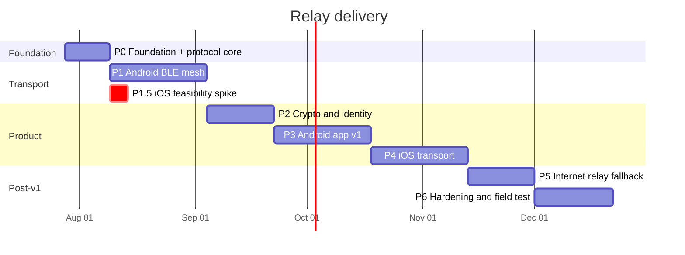

# Relay — Delivery Plan

**Status:** Approved, pre-implementation
**Assumes:** 1–2 developers, no fixed external deadline
**Companion documents:** [ARCHITECTURE.md](ARCHITECTURE.md), [design spec](design/2026-07-25-mesh-chat-design.md)

---

## How to read this plan

Every phase has an **exit gate** — a concrete, demonstrable result. A phase is not complete because the tasks are ticked; it is complete when the gate is demonstrated. Gates are written so they cannot be satisfied by a passing unit test alone where physical behaviour is the point.

Phases 0 through 4 constitute v1. Phases 5 onward are post-v1.

Total to v1: approximately **4.5 to 5 months**. Phases 1 and 6 are the ones that historically overrun; treat their estimates as optimistic.

---

## Phase 0 — Foundation and protocol core

**Duration:** 1–2 weeks
**Goal:** the packet format and mesh routing logic exist, are fully tested, and are provably correct without any hardware.

This phase front-loads the two things that are most expensive to change later: the wire format and the relay algorithm.

### Tasks

- Initialise git repository, pub workspace, and package skeletons per the architecture layout
- CI pipeline: analyze, format check, test
- `core_protocol`: 20-byte header encode/decode, all eight frame types
- `core_protocol`: fragmentation and reassembly with bounded buffers and expiry
- `core_protocol`: LZ4 compression with the keep-only-if-smaller rule
- `core_protocol`: TTL, deduplication set, jitter and suppression decision logic as pure functions
- `transport_api`: abstract `Transport` interface
- `transport_fake`: in-memory N-node mesh with configurable loss, latency, topology, and partition
- `testvectors/protocol/` and `testvectors/relay/`: golden JSON consumed by Dart now, Kotlin and Swift later
- `data`: Drift schema and migrations for all tables

### Exit gate

A pure Dart test spins up a simulated 20-node mesh with a diameter of at most 6, sends a message to a destination at least 3 hops away, and asserts exactly one delivery with a hop count above 1 — under 20% simulated packet loss and across one mid-run partition-and-heal cycle.

> **Corrected during Phase 0.** This gate originally read "node 1 to node 20 across a chain". That is impossible: `maxTtl` is 7 and a 20-node chain needs 19 hops. The gate now specifies a bounded-diameter mesh, which is both achievable and a better model of a crowd.

### Risks

Getting the header wrong here is cheap to fix and expensive later. Spend the extra day on adversarial codec tests: truncated frames, absurd fragment counts, TTL overflow, duplicate fragment indices.

### Outcome

Complete. 133 tests pass, analyzer clean under `--fatal-infos`. Two design defects were found and fixed by the simulator before any hardware existed:

1. **Deduplication keyed on `msgId` alone** discarded every fragment after the first, so no multi-fragment message could cross a relay. The key is now `(msgId, fragmentIndex)`.
2. **Store-and-forward only triggered on total isolation**, so a partition healed without delivering anything. Replaced by an originator outbox that retries with a fresh `msgId`, which in turn required end-to-end duplicate suppression at the application layer.

Both are reflected in ARCHITECTURE.md section 3 and pinned by the shared relay vectors.

---

## Phase 1 — Android BLE mesh

**Duration:** 3–4 weeks
**Goal:** real Android phones form a working mesh and relay for each other in the background.

This is the highest-risk engineering phase and the one that proves the product is possible.

### Tasks

- Pigeon contract definition and code generation for `BleHostApi` / `BleFlutterApi`
- `Advertiser`: custom 128-bit service UUID advertising, with `isMultipleAdvertisementSupported` detection and central-only degradation
- `Scanner`: duty-cycled scanning driven by `PowerPolicy`
- `GattServerController`: peripheral role, write-without-response inbound characteristic, notify outbound characteristic
- `GattClientController`: central role, connection management, MTU negotiation, connection rotation above the chipset ceiling
- Concurrent dual-role operation and connection table management
- `MeshForegroundService` with the `connectedDevice` service type and an honest persistent notification
- `RelayEngine.kt` implementing the algorithm in ARCHITECTURE §3.5, passing `testvectors/relay/`
- `PacketStore.kt`: Room-backed inbox and store-and-forward queue with the documented bounds
- `transport_ble` Dart side, implementing `Transport`
- Runtime permission flow for Android 12+ with `neverForLocation`
- Per-OEM battery exemption deep links (Xiaomi, Oppo, Vivo, Huawei, Samsung)
- Minimal debug UI: peer list, raw send, frame log

### Exit gate

**Three physical Android phones, from at least two manufacturers.** Phone A and phone C are placed out of direct Bluetooth range of each other, with phone B between them. A message sent from A arrives at C via B, **with all three screens locked and all three apps backgrounded**, within 10 seconds.

A screen recording of this is the phase deliverable, not a test report.

### Risks

Chipset variation is the main hazard. Budget time for at least one device that refuses to advertise, and confirm the central-only degradation path works rather than crashing.

### Outcome

**Partially complete. The gate is NOT met and cannot be met without hardware.**

Written and cross-verified:
- `RelayEngine.kt` — passes all 8 shared relay vectors, including frame codec round-trip, run under a real Kotlin compiler. Dart, Kotlin and Swift now provably agree byte for byte.
- `PacketStore.kt`, `PowerPolicy.kt`, `MeshBleBridge.kt`, `MeshForegroundService.kt` (dual-role GATT server and client, advertising, scanning, jittered relay, per-OEM battery deep links).
- Pigeon contract in `packages/transport_ble/pigeons/ble_api.dart`.

**Now compiling.** The Gradle project exists, the manifest declares the Bluetooth runtime permissions (with `neverForLocation`), the `connectedDevice` foreground service and the battery-exemption permission, and `flutter build apk --debug` succeeds with every `dev.kishorek.relay.ble` class present in the artifact — `MeshForegroundService`, `PacketStore`, `PowerPolicy`, `RelayEngine`, `MeshBleBridge`.

Compiling is not working. The Pigeon bindings have since been generated and wired on both sides — `BleApi.g.dart`, `BleApi.g.kt`, `BleApi.g.swift`, with a CI check that fails if any of them drifts from the contract — but none of it has run on a phone and no BLE call has ever executed against a real radio. The gate — three locked, backgrounded phones relaying a message on video — remains open.

---

## Phase 1.5 — iOS feasibility spike

**Duration:** 3–5 days
**Runs in parallel with Phase 1, starting in week 2**
**Goal:** replace assumptions about iOS background Bluetooth with measurements, while the architecture can still absorb the answer.

This is deliberately throwaway code. Do not build it well; build it fast.

### Tasks

- Minimal Swift app: advertise a service UUID, scan for the same UUID, log discoveries with timestamps
- `UIBackgroundModes` with `bluetooth-central` and `bluetooth-peripheral`, State Restoration on both managers
- Measure iPhone → iPhone discovery latency, foreground and background
- Measure **iPhone (background) → Android** discovery: confirm and quantify the overflow-area limitation
- Measure Android → iPhone (background) discovery
- Measure how long iOS sustains background Bluetooth activity before throttling
- Measure battery drain over one hour of background scanning and advertising

### Exit gate

A written findings note in `docs/spikes/ios-ble-findings.md` containing real numbers, and an explicit **go / adjust / no-go** recommendation for the Phase 4 design.

### Decision this gate feeds

If a backgrounded iPhone proves undiscoverable by Android in practice — the expected outcome — then Phase 4 must scope iOS as **foreground-capable mesh plus background relay among iOS devices only**, with cross-platform background reach depending on the Phase 5 internet fallback. Discovering this now is the entire point of the spike; discovering it in month four would invalidate the plan.

---

## Phase 2 — Cryptography and identity

**Duration:** 2–3 weeks
**Goal:** messages are genuinely end-to-end encrypted and contacts cannot be impersonated.

### Tasks

- `core_crypto`: Noise XX state machine, implemented against the specification's published test vectors
- `core_crypto`: ChaCha20-Poly1305 AEAD wrapper with strict nonce discipline and session abort on nonce exhaustion
- `core_crypto`: rekey after 100 messages or 10 minutes
- `core_identity`: Ed25519 long-term keypair, generated on first run into Android Keystore (StrongBox where available) and iOS Keychain, never backed up
- `core_identity`: per-session X25519 keypair and `srcHash` derivation
- `core_identity`: `ANNOUNCE` payload carrying the session key signed by the identity key
- `core_identity`: contact pinning, trust states, and blocking warning on key change
- Safety phrase: 6-word derivation from key fingerprint
- QR generation and scanning for contact exchange
- Room key derivation: Argon2id with the documented parameters, benchmarked to roughly 500 ms on a mid-range device
- Handshake integration into `messaging`, including handshake-in-flight queuing

### Exit gate

Two devices complete a Noise XX handshake over the real BLE transport and exchange encrypted messages. A third device positioned between them relays the traffic successfully while a packet capture confirms it cannot read the plaintext. A simulated key-change attack on a pinned contact produces the blocking warning rather than silent acceptance.

### Risks

The Noise port is the single highest-consequence correctness risk in the project. It is isolated and vector-tested for exactly that reason. Do not let it be reviewed only by its author.

### Outcome

Cryptography and identity are complete and verified: 62 tests across `core_crypto` and `core_identity`.

The Noise XX implementation reproduces the official cacophony vector for `Noise_XX_25519_ChaChaPoly_BLAKE2s` byte for byte — all three handshake messages, the handshake hash, and every transport message. This matters more than a round-trip test: a Noise implementation with a subtly wrong HKDF still talks happily to itself while losing the security properties it claims.

One defect found and avoided:

- **`package:cryptography` reports `Blake2s.blockLengthInBytes == 32`.** The real BLAKE2s block size is 64. Using that package's `Hmac(Blake2s())` would have produced a non-standard MAC, corrupting Noise's HKDF invisibly. `core_crypto` implements HMAC-BLAKE2s directly and pins it with five known-answer tests.

**The gate is only partly discharged.** It requires the handshake to run "over the real BLE transport" with a third device relaying, which is blocked on Phase 1. The cryptography itself is verified; its behaviour on the wire is not.

---

## Phase 3 — Android application v1

**Duration:** 3–4 weeks
**Goal:** a complete, shippable Android product.

### Tasks

- Design system: colour, type scale, spacing, motion, dark-first with a light theme
- Home screen, layout C: presence strip over chat list
- Radar view as a secondary tab, distance from centre mapped to signal strength
- Conversation screen: text, emoji, reactions, replies
- Honest message state UI: `queued`, `sent`, `delivered`, `read`, `failed`, `expired` — visually distinct, with an explainer on first encounter of `sent`
- Voice notes: record with a 30-second cap, Opus at 8 kbit/s, waveform, playback, progressive delivery display
- Contacts: QR pairing flow, safety phrase comparison screen, verified badge
- Rooms: join by code, create code, **plain-language security warning on the join screen**
- Onboarding: purpose, permissions with rationale, battery exemption, identity creation
- Degraded-state surfaces: adapter off, permissions denied, peripheral unsupported, zero peers
- Settings: nickname, power mode selector with battery-cost explanation, diagnostics screen
- Widget tests across all degraded states
- Accessibility pass: screen reader labels, contrast, minimum tap targets, text scaling

### Exit gate

An internal group of at least five people uses the app for a full day at a real gathering, with no crashes, and completes: pairing by QR, joining a room by code, exchanging text and voice notes, and correctly observing a message move from `sent` to `delivered` when a recipient walks back into range.

### Outcome

**Partially complete.** Layout C is built and covered by 18 widget tests: presence strip above the chat list, reachability-coloured avatars, honest six-state message display, every degraded transport state, and the room-code security warning. Tests assert the product principles directly — that `sent` is visually distinct from `delivered`, that an unreachable peer never appears present, and that a room is never marked strongly encrypted.

Now built and covered by 46 widget tests: home (Layout C), conversation screen with honest per-message state and retry, voice-note rendering, radar with an explicit "this is not a map" disclaimer, room join and its security warning, onboarding with the battery-exemption step, settings with per-mode battery costs, an in-product threat-model summary, and a confirmed panic wipe.

A real layout bug was found and fixed by these tests: a long state label such as "Never delivered" beside a retry action overflowed the message bubble by 25px.

**Now complete in software.** The remaining gaps have been closed:

- **The transport is wired.** `MeshRuntime` connects the BLE transport, the Noise session layer, the message service and SQLite to `AppState`. Twelve integration tests run two complete runtimes against a paired transport and assert that a message written on one device is decrypted and stored on the other, that nothing readable crosses the wire, that an ack turns `sent` into `delivered`, that a message written during a partition is delivered when the link returns, and that panic wipe leaves nothing behind.
- **QR scanning** — `ScanScreen` over `mobile_scanner`, plus a real rendered QR code on the pairing screen with the payload also shown as text for a cracked screen or a dead camera. `PairingPayload` is versioned and covered by 9 tests, including that other people's QR codes are ignored rather than treated as errors.
- **Voice** — `VoiceRecorder` and `VoicePlayer`: Opus at 16 kbit/s mono, capped at 30 seconds. The cap is a mesh-fairness limit, not a UI preference; a ten-second note is already 125 frames.
- **Diagnostics** — a screen that explains each counter in words rather than labelling a number, covered by 6 widget tests.

Two real bugs were found and fixed while wiring this up. Message bodies were encoded with `String.codeUnits`, which is UTF-16 — every character above U+00FF was silently truncated, so any message in Hindi, Arabic, Chinese or containing an emoji would have arrived as mojibake. The same bug was in the presence beacon's nickname. Both now use UTF-8, with the nickname truncated on a character boundary.

The gate itself — five people, a real gathering, a full day — still requires hardware and has not been attempted.

---

## Phase 4 — iOS transport

**Duration:** 3–4 weeks
**Goal:** iOS reaches parity with Android within the limits the Phase 1.5 spike established.

Scope here is **conditional on the Phase 1.5 findings** and must be re-planned against them before starting.

### Tasks

- `CentralController` and `PeripheralController` with concurrent dual-role operation
- State Preservation and Restoration on both managers, with stable restoration identifiers
- `RelayEngine.swift`, passing the identical `testvectors/relay/` suite as Kotlin
- `PacketStore.swift` with the same bounds as Android
- Background mode configuration and App Store justification text prepared
- Permission flow and iOS-specific degraded states
- Cross-platform interoperability testing against Android
- Honest in-app disclosure of iOS background discovery limits where they affect the user

### Exit gate

`testvectors/relay/` passes identically on Kotlin and Swift in CI. An iPhone and an Android phone exchange messages in both directions with both apps foregrounded, in under 15 seconds from cold discovery. Background behaviour matches the Phase 1.5 measurements, and any shortfall is disclosed in the app rather than hidden.

### Outcome

**Partially complete.** The vector half of the gate is met: `RelayEngine.swift` passes all 8 shared vectors, and `MeshManager.swift` + `PacketStore.swift` typecheck against the real CoreBluetooth SDK. State Preservation and Restoration is wired on both managers.

The Swift sources are now registered in `Runner.xcodeproj`, so they will actually be compiled — previously they sat in the right folder but outside the target and would have been silently ignored.

`MeshBlePlugin.swift` now implements the generated Pigeon host API and is registered by `AppDelegate`, and `MeshManager` gained the peer registry, presence beacon, runtime power-mode switching and adapter-state reporting that Android already had. The whole iOS source set — including the generated Pigeon bindings and the plugin — typechecks against the real iOS SDK and the real Flutter framework at deployment target 14.0, which is what caught `CBManager.authorization` being unavailable at the previous target of 13.0.

A full `flutter build ios` still cannot run here: the iOS 26.5 platform component is not installed in this Xcode, so `xcodebuild` finds no eligible destination. CI now runs that build on `macos-latest`, which is the only thing that proves the mesh sources are genuinely in the Xcode target — they were silently excluded from it once already. The device half of the gate is untouched, and the Phase 1.5 spike has still not been done, so the background-discovery numbers this phase depends on remain assumptions.

---

## Phase 5 — Internet relay fallback

**Duration:** 2–3 weeks
**Goal:** messages reach recipients who are out of Bluetooth range but online.

### Tasks

- `transport_nostr`: websocket relay client with a pool of public relays and health-based rotation
- Sealed envelope construction so relays learn neither content nor recipient
- Ephemeral per-context keys, avoiding a stable identifier across relay traffic
- `TransportRouter`: choose Bluetooth when the peer is in mesh range, relay otherwise, deduplicate across both paths by `msgId`
- Delivery acknowledgement unification across transports
- User-facing transport indicator, so it is always clear whether a message went over Bluetooth or the internet
- Stealth Mode disables this transport entirely

### Exit gate

Two devices with no Bluetooth path between them exchange messages through public relays. A device that moves from relay range into Bluetooth range switches transport without duplicating messages or losing ordering.

### Outcome

**Partially complete.** `TransportRouter` and `MessageDeduplicator` are built and covered by 12 tests: mesh preferred when the peer is in range, relay fallback when not, broadcasts never sent to a relay, stealth mode blocking the relay with a stated reason, honest refusal when nothing can be sent, and cross-transport duplicate suppression keyed on sender plus sequence.

**Now complete in software.** The relay client is built and interoperable, not merely self-consistent:

- **NIP-44 v2** encryption, verified against the specification's own `nip44.vectors.json`, vendored at `testvectors/nostr/`. All 35 conversation-key vectors, all 10 encrypt/decrypt vectors, all 24 padding vectors and all 12 invalid-payload vectors pass. This matters because an implementation that only ever talks to itself passes every test it has while being unreadable by every real client.
- **ChaCha20** written out to RFC 8439, with a 32-bit counter and a 12-byte nonce, and checked against the RFC's own test vector. The available Dart implementation is the original DJB variant, whose different state layout produces a completely different keystream from the same inputs — a failure that would only ever surface as "no Nostr client can read us".
- **BIP-340 Schnorr** signing and verification over secp256k1, with event ids checked as well as signatures, so a genuine signature over altered content is rejected.
- **NIP-59 gift wrap**: rumor, seal and wrap. Eleven tests, including that the outer event never names the sender, that two wraps of the same frame look unrelated, and that a seal claiming an author it did not sign for is refused.
- **`RelayPool`**: several relays at once, deduplication by event id, subscription replay on reconnect, and reconnection with a delay.
- **`NostrTransport`** implements the same `Transport` interface as Bluetooth. Broadcast is refused outright — "everyone near me" has no meaning on the internet, and fanning out to every contact would hand the relays a contact list one message at a time.

The one piece of metadata this design cannot hide is the recipient tag: a relay has to know who to deliver to. That is stated in the code and in the threat model rather than glossed over.

---

## Phase 6 — Hardening, security review, field test

**Duration:** 3+ weeks
**Goal:** the app survives real conditions and its security claims have been checked by someone other than its author.

### Tasks

- Battery profiling and tuning across all three power modes; target under 6% per hour backgrounded and relaying in balanced mode
- OEM device matrix: verify foreground service survival across Xiaomi, Oppo, Vivo, Huawei, Samsung, Pixel
- Stealth Mode: advertising suppression, presence suppression, relay-only operation
- Panic wipe: keystore purge, database destruction, native packet store clear, verified unrecoverable
- Dense-crowd load testing: verify flood suppression holds at 50-plus nodes
- **External security review** of the Noise implementation, key handling, and room key derivation
- Threat model published in-app, including the plainly stated non-defences
- Crash and diagnostics reporting, local-only by default
- Store listing, privacy disclosures, and export-compliance declaration for encryption

### Exit gate

A field test at a genuinely crowded venue with at least 10 real users over several hours: message delivery rate recorded, battery drain recorded, no crashes, no data loss. The external security review is complete and its findings are either fixed or publicly documented.

**The app must not be marketed as safe for activism until this gate is passed.**

### Outcome

**Software half complete; every hardware- and human-dependent item is still open.**

Done, with tests:

- **Dense-crowd load test.** 11 tests in `packages/transport_fake/test/dense_crowd_test.dart`. Flood suppression holds: per-node transmission cost stays flat at 2.4–4.1 from 20 to 80 nodes, where naive flooding would grow without bound. A denser crowd needs *fewer* relays than a sparse one, which is the witness-suppression mechanism working as designed. Directed messages survive 40% packet loss once retries are allowed, and arrive exactly once.
- **Panic wipe.** 10 tests reading the raw bytes of every file in the database directory. This **found a real vulnerability**: after a wipe, message text, contact names and room codes were all still recoverable — sitting in the write-ahead log and in free pages that `DELETE FROM` had merely marked reusable. Fixed with `PRAGMA secure_delete`, `wal_checkpoint(TRUNCATE)` and `VACUUM`.
- **Stealth mode.** 6 tests: no beacon goes out, no peer learns the nickname or mesh address, the internet relay is disabled, relaying continues, and turning it off re-announces immediately.
- **Power modes** are now a cross-language contract at `testvectors/power/modes.json`, checked by Dart tests and by new Kotlin and Swift parity runners in CI. `PowerPolicy` was split so the cross-platform figures compile without the platform SDK. The contract carries `measured: false` and a test asserts it, so the estimates cannot be quietly mistaken for measurements.
- **A real gap closed while doing this:** nothing ever called `setAnnounce`, so the native presence beacon had no content and never fired. A closed app therefore stopped being discoverable. Now pushed on start and whenever stealth changes.
- **Local-only diagnostics.** An in-memory `EventLog`, bounded, cleared by panic wipe, surfaced in the diagnostics screen with a copy button. No crash reporter, no analytics, no upload path — and a test that fails if anything resembling one is added.
- **`docs/SECURITY.md`** — a review pack: claims, explicit non-claims, a full cryptographic inventory with what each part is verified against, and a ranked list of what the authors are least confident about. The framed-Noise deviation is called out first.
- **`docs/FIELD-TEST.md`** — battery, OEM matrix, interoperability and crowd-test protocols, written so results are reproducible and so unflattering numbers get recorded rather than retried.
- **`docs/RELEASE.md`** — export compliance, background-mode justifications, data-safety answers, and the fact that release builds are still signed with the debug key.
- **`ITSAppUsesNonExemptEncryption`** declared `true` in `Info.plist`, which is the truthful answer.

Still open, and not closable without hardware or a third party:

- Battery profiling on real devices. The figures remain engineering estimates.
- The OEM device matrix. The detection and deep-links exist; nobody has checked they still resolve.
- The external security review.
- The field test with real users at a real venue.

---

## Supporting layers (added during implementation)

Neither was a numbered phase, but both are prerequisites for wiring the app together.

**`data`** — SQLite persistence: conversations, messages, outbox with exponential backoff and a 24-hour expiry, contacts, and cross-transport message deduplication. 18 tests. Message state is enforced to only move forward, so a late delivery receipt cannot un-read a message.

**`messaging`** — end-to-end orchestration: encryption, fragmenting, routing, outbox persistence before transmission, retry, and inbound deduplication. 44 tests. It reports `sent` and never `delivered` on transmission, which is the single most important honesty constraint in the product.

`SessionManager` holds the Noise session for every peer. A message to a peer with no session opens a handshake and leaves the message in the outbox; there is no code path that puts a readable payload on a wire, and `encrypt` throws rather than falling back to plaintext. Completing a handshake flushes what was waiting immediately rather than making the user wait out a backoff timer whose reason has gone away.

**`transport_ble`** — the Pigeon channel to the native radio. 21 tests. Refuses to start without permission or with Bluetooth off, reporting which of the two it is, because calling into the platform anyway makes Android throw on a BLE callback thread and the user sees only the app dying.

**`transport_wifi`** — the local-network transport, added after Phase 6 in response to a direct question: if a router has no internet, can everyone on it still chat? They could not; they fell back to Bluetooth and the router sat unused. Now they can, at roughly a hundred times the throughput.

51 tests. Only mDNS is faked in them — the sockets are real TCP on loopback, including the case that matters most: two devices discovering each other in the same instant, both dialling, and having to agree which of the two connections to keep. They agree by keeping the one opened by the lower address hash, which each side computes from the link hello.

It changes nothing about encryption. The same sealed frames cross the wire, and `CompositeTransport` in `transport_api` presents both radios to everything above as one mesh, tagging peer ids with the transport they arrived on so a reply goes back the way it came.

Deliberately not a replacement for Bluetooth: it needs a network that already exists, does nothing in a street or a field, and on iOS stops when the app is backgrounded. It is also the only transport whose traffic a third party — the network's owner — can watch happening, which is why it has its own switch in Settings and its own line in the in-app threat model.

### A protocol change forced by the mesh

Noise's transport phase uses an implicit nonce counter advanced in lockstep on both sides. That is correct over an ordered, reliable transport and wrong over BLE: the first lost frame leaves the receiver permanently one step behind, and every later message fails to open, forever. The mesh path therefore transmits the nonce with each message and applies a 64-entry sliding replay window on receipt. The Noise-conformant path is kept intact and is still what the published cacophony vectors are checked against.

---

## Phase 6b — Parity with bitchat

An audit against `github.com/permissionlesstech/bitchat` found fifteen features
it had and Relay did not. All fifteen now have an implementation. Two of them —
couriers and location channels — were built by reading bitchat's own source
(`CourierEnvelope.swift`, `CourierStore.swift`, `Geohash.swift`,
`LocationChannel.swift`) rather than its prose, so the limits and the wire shape
match a design that has actually been deployed.

**Built:** LZ4 compression · packet padding · read receipts on the wire ·
blocking · favourites · `@` mentions with autocomplete · room catch-up on join ·
room ownership, transfer and retention · IRC-style commands · three-tap
emergency wipe · message batching · cover traffic · SOCKS5/Tor relay routing ·
courier envelopes · geohash location channels.

**Couriers are wired end to end.** `FrameType.courier` (0x0D) exists in all three
languages, `MeshRuntime.offerMail` runs on every announce, and
`depositWithCouriers` hands sealed mail to trusted carriers. Proven over real
sockets in `app/test/courier_runtime_test.dart`: Carol seals for Bob, Alice
carries it, Alice meets Bob, Bob reads it, and Alice never sees the contents.

Wiring it turned up a prerequisite that had been missed: **nothing ever
transmitted an X25519 key**, so no envelope could be sealed for anybody. The
announce now carries one (§3.1a) and the store keeps it against the contact.
Two consequences are deliberate and permanent — a peer who has never announced
cannot be couriered to, and mail whose sender this device has never heard is
dropped rather than shown under a placeholder.

**Still to wire up.** One of the fifteen is complete as a library and is not yet
reachable from the app:

| Item | State |
|---|---|
| Location channels | `Geohash` (encode, decode, neighbours) and `GeohashChannel` (six levels) are built and checked against the canonical reference value. Subscribing to one needs the Nostr relay running in the app, and the app does not enable the internet relay at all yet. |

**Now in the UI.** Couriering was, for a while, a complete protocol with no way
to see or refuse it. Bounded and safe by default is not the same as consented
to, and `depositWithCouriers` was reachable only from tests — a feature that
cannot be invoked from the product is not a feature. Four things closed that:

| Surface | Behaviour |
|---|---|
| Settings switch | "Carry messages for other people", on by default, persisted. Off stops *accepting* new mail and stops spraying. |
| Carried count | "Holding N messages for other people", with a confirmed drop. |
| `Carried` chip | On any message a person walked here rather than a radio delivering it. |
| "Send by hand" | On an outgoing direct message that has not got through. |

Four decisions in there are worth keeping:

- **Turning it off still delivers what is already held.** The copy is on this
  device, handing it over costs one transmission, and it is the only way that
  message ever arrives. Withholding it would be pure loss to a third party who
  never gets told.
- **Dropping is separate from the switch, and asks first.** Every held envelope
  is somebody's undelivered message, none can be recovered, and the sender is
  never informed. That is not a side effect to bury in a toggle.
- **The word "courier" never reaches the user.** It is from the protocol notes.
  The interface says carry, carried, send by hand.
- **A refusal says which refusal.** `CourierRefusal` distinguishes a room, a
  recipient who has never announced, nobody trusted nearby, and stealth mode.
  Each has a different next move; "could not send" has none.

Provenance needed a new column (`messages.via_courier`) rather than reusing
`transport`, which records the link the last hop used. A couriered message also
arrives over a link — the difference is that it waited in somebody's pocket
first, and that is not derivable once the envelope is open.

---

## Phase 6c — UI parity and responsiveness

A second audit, this time against both bitchat repos — the iOS/macOS one and
`bitchat-android`, whose README lists the UI features explicitly.

**Built.**

| Item | Notes |
|---|---|
| Responsive layout | Three breakpoints, two-pane on large tablets and desktop, selection that survives rotation. See ARCHITECTURE §8.1. |
| Text scaling | Honoured to 1.6x, clamped above, applied once for the whole app. |
| Overflow matrix | Every screen × four sizes, in CI. Found four real defects. |
| Light / dark / system theme | The light theme existed and was unreachable — `themeMode` was hardcoded. Now chosen in Settings and persisted. |
| Signal strength per peer | RSSI was plumbed from Android native through `transport_api` and stopped there. Now three bars on the presence strip. |
| Haptics | Distinct feedback for sent, delivered, failed and mentioned; a switch in Settings; the emergency wipe buzzes regardless. |
| Fourth power mode | `ultraLow`, matching bitchat's floor. Added to Dart, Kotlin, Swift *and* `testvectors/power/modes.json`, which pins all three. |
| `/slap` | Sends a message. It does nothing to the named person. |

**Deliberately not copied.**

- **Terminal aesthetic.** bitchat-android's look is a monospace terminal.
  Relay's premise is better UI/UX for people who are not developers, and a
  green-on-black console is the opposite of that.
- **Foreground-service notification styling** and other Android-only surface —
  Relay has one codebase and the native layer is deliberately thin.

**Known gaps, stated rather than hidden.**

- **Signal bars are Bluetooth-only.** A peer reached over Wi-Fi or through a
  relay has no measured RSSI, and none is invented — `Peer.signal` answers null
  and the bars are absent rather than empty.
- **The 1.6x clamp is a measured limit, not a preference.** It is where every
  screen currently still fits. Raising it means fixing screens first.
- **No screenshot or golden tests.** The overflow matrix proves nothing
  *overflows*; it does not prove anything looks right. That needs a human or a
  golden-file suite, and neither exists yet.

Three things about the built list are worth stating plainly, because they are
deviations rather than copies:

- **`/pass` does not re-key a room automatically.** It announces the new code
  and members act on it. An automatic re-key on a remote instruction would let
  anyone holding the owner's key move a whole group unnoticed.
- **Courier tags use HMAC-BLAKE2s, not HMAC-SHA256.** The construction is
  bitchat's — keyed on the recipient's static key, over a context string and the
  UTC day, truncated to 16 bytes. The hash is the one already underneath Relay's
  Noise suite; adding a second hash family to copy a byte sequence Relay is not
  wire-compatible with anyway would be cost without benefit.
- **Tor has no bundled daemon.** The SOCKS5 client and the proxied relay socket
  are complete and tested; shipping a Tor binary per platform is a vendoring
  task that cannot be verified here. See `docs/SECURITY.md` §3.7.

---

## Phase 6d — Name and identity

Naming was settled before any build could be submitted, because App Review
rejects confusingly similar names and finding that out after submission is the
expensive way.

### The category is crowded

Checking candidates turned up how little room there is. Murmur is a registered
trademark held by a messaging company. Ember has at least four live chat apps.
Pigeon has three. Tern has Ternchat. **Fern** was the closest call:
[Fernweh](https://www.fernweh.chat/) is a shipping BLE and Wi-Fi Direct offline
mesh messenger — the same product, in the same category, with the same
transports.

### What was decided

**Relay**, with one trade-off accepted knowingly: it is a descriptive word, so
it is legally weak. Other Relay apps exist and a competitor cannot easily be
stopped from using it. That was the user's call, made with the objection stated.

The rationale, palette and regeneration steps live in
[`brand/README.md`](../brand/README.md).

### Built

| Item | Notes |
|---|---|
| Logo | Wave through a hollow node: a message hops over a phone that carries it and cannot read it. Four concepts were drawn and rejected first — see below. |
| Icon sets | iOS (15 sizes, no alpha), Android legacy + adaptive + Android 13 monochrome, store exports. All generated from `brand/*.svg`; no PNG is hand-edited. |
| In-app mark | `app/lib/src/ui/brand.dart`, a painter rather than an asset — sharp at any size, themed, no bundled image. |
| Identifiers | `dev.kishorek.relay` on both platforms — the reverse of `kishorek.dev`, a domain the publisher owns. An application id is permanent once a build reaches a store. |
| Launch screen | Both platforms shipped Flutter's stock **white** splash into a dark-by-default app. Now the mark on a themed background, following the system dark-mode setting. Android uses a vector, so there is nothing to re-export. |
| Naming policy | Brand name kept out of code. See below. |

### The brand name is not in the identifiers

The code already used the word "relay" 459 times as a verb and a mechanism:
Nostr relays, the BLE `RelayEngine`, `allowRelay`, TTL relay decisions. Naming
types after the product on top of that would have produced documentation reading
"Relay relays via relays."

So types are named for what they do — `AppColors`, `AppTextScale`, `LocalStore`,
`MeshRuntime`, `MeshIdentity`, `MeshBlePlugin`, `MeshDiscoveryPlugin`. The sole
exception is `RelayMark`, which is the logo.

This is worth keeping if the name ever changes.

### Five strings that must never be edited

`relay-addr-v1`, `relay-safety-v1`, `relay-room-v1`, `relay-roomid-v1` and
`relay-courier-tag-v1` are domain separators, hashed into every address, safety
number, room code and courier tag. They read like ordinary descriptive strings,
which is the danger: editing one for tidiness compiles, passes a smoke test, and
changes the identity of every user. Every safety number appears to have changed,
which is indistinguishable from an attack.

`app/test/brand_test.dart` fails if one of them moves. The fix, if they ever
must, is a `-v2` constant beside them, not an edit.

### Rejected designs

Worth recording, because three of the four failed for reasons that are only
visible once drawn:

| Concept | Why not |
|---|---|
| Arch with an inner ring | Reads as a capital **A**. The ring becomes the counter. |
| Flat bridge over three nodes | Reads as an **eye**. The worst available reading for this app. |
| Rising diagonal with nodes | Reads as an analytics chart. |
| Kite | Best story and best silhouette of any candidate, dropped over Zerodha Kite — different category, but a name collision that loud kills word of mouth in one of the likely markets. |

### A wipe hole this closed

Panic wipe erases the database the running process has open. Any other database
file in the same directory — one left by an earlier build under a name this
build never opens — survives untouched, with its message history in it, while
the app reports a successful wipe. Intact plaintext plus an assurance it is gone
is worse than either alone.

`LocalStore.eraseForeignDatabases` now runs at startup, before the store is
opened, so an orphan does not survive a single launch and the user is not
required to have pressed anything. It is an allow-list of names this build owns,
not a list of old ones: a list of old names has to be extended by whoever
renames a database next, who is the same person who has already forgotten. Six
tests in `packages/data/test/orphan_database_test.dart`, including that the
`-wal` and `-shm` sidecars go with the file — in WAL mode the most recent
conversation lives there and not in the database at all — and that non-database
files are left alone, because that directory is not exclusively ours.

---

## Phase 6e — Features that could not be reached

Asked "is the development part done?", the honest answer needed checking rather
than asserting. Re-running the check that caught the courier UI found two more
of exactly the same thing.

### The bug class

A public method, fully implemented, fully tested, correct — and called by
nothing outside the test suite. Nothing catches it. The analyzer sees a public
API and assumes an external caller. The tests pass, because the tests *are* the
caller. Coverage is high for the same reason. It looks finished from every angle
except using it.

| Found | What the user experienced |
|---|---|
| `depositWithCouriers` | Couriering could not be invoked at all. Closed in Phase 6d. |
| `leaveRoom` | A group could be joined and never left. While you are in a room your phone answers strangers' requests for its history, so a room you had forgotten was a room you were still serving. |
| `voiceBytesOf` / `VoicePlayer` | **The bubble drew a play arrow that did nothing.** `VoicePlayer` was constructed in `main.dart` and never called. Record, send, arrive, press — nothing, and no error, because nothing had gone wrong. |

The voice one is the worst of the three. A missing feature is invisible; a
control that looks live and is not teaches the user the app is broken in ways
they cannot describe.

### Closed

- **`/leave`** (and `/part`), plus **Leave this group** in the conversation
  menu, which now builds itself from the actions a conversation actually has
  rather than assuming direct-only. The menu item routes through the command
  runner so it and the typed command cannot drift.
- **Voice playback**, with press-again-to-stop, the icon reflecting state, a
  screen-reader label, and honest errors for a note that arrived malformed or
  in a codec the phone will not open.

### The guard

`app/test/reachable_test.dart` fails if any public `MeshRuntime` member has no
caller in `app/lib` or `packages/*/lib`. Genuine test seams carry
`@visibleForTesting` — a claim that this is a seam and not a feature, which is
the distinction both bugs blurred. The allow-list has one entry and a test
asserting it has not grown, because a guard whose exceptions expand is a guard
being switched off one line at a time.

### Two things it exposed on the way

- **`relaysFor` was a tautology.** Its body was the literal `true`, and
  `blocking_test.dart` asserted it returned true. Someone could have taught the
  native relay to skip blocked senders and that test would still have passed —
  the relay is not in Dart. Deleted. The guarantee is now asserted where it is
  kept: `RelayEngine.kt` and `RelayEngine.swift` contain no concept of blocking,
  and the test fails if one appears.
- **`relayAllowedFor` and `isFavouriteAddress` were the same lookup written
  twice**, which is how two rules drift into disagreeing. One now delegates to
  the other.

---

## Phase 6f — Repository structure

The tree had grown by accretion, and moving the Kotlin sources under
`dev/kishorek/relay/` had left a trail of references to where they used to be.

### What was actually broken

- **CI could not have passed.** `ci.yml` still compiled `RelayEngine.kt` from
  the old Kotlin package path, which had stopped existing when the sources
  moved. The Kotlin parity job would have failed on a missing source file.
  Worse, the Pigeon staleness check ran
  `git diff -- <two paths that no longer exist>`, which succeeds quietly — the
  check had stopped covering the Kotlin bindings entirely and reported success
  while doing so.
- **`.gitignore` patterns that never matched anything.** A pattern containing a
  slash is anchored to the directory holding the file, so `ios/Pods/` meant
  `<root>/ios/Pods` — but the app is at `app/ios`. Every iOS and Android
  ignore rule was inert. Nothing had been committed yet, which is the only
  reason `Pods/`, `local.properties` and any future keystore were not already
  in the history.
- **A Kotlin unit test still sitting under the old package directory** while
  declaring `package dev.kishorek.relay.ble`. Kotlin permits the mismatch and
  Gradle does not complain, so nothing failed — the test simply was not where
  anyone would look for it.
- **A Swift parity harness inside the app's own source tree.**
  `app/ios/Runner/Ble/RelayVectorTests.swift` was byte-identical to
  `tools/relay_parity_swift/main.swift`, and CI copied it out to build it. A
  file with top-level code in the Runner directory is one careless "add files
  to target" away from breaking the iOS build.
- **Documentation describing a tree that did not exist**, including a
  `tools/meshlab/` that was never built and a `data/` package described as
  Drift when it has always been `package:sqlite3`.

### The layout now

Root gains the files whose absence is the loudest signal a repository is not
maintained: `README.md`, `CONTRIBUTING.md`, `CHANGELOG.md`, `.editorconfig`,
issue and pull-request templates, and a private security-reporting route
separate from the threat model. A separate archive of design records was folded
into this file: a second copy of the rationale is a second copy to keep true,
and the one nobody updates is the one people read.

`app/lib/src` is now four directories split by what a file may depend on:

| Directory | May import |
|---|---|
| `domain/` | Dart and the core packages — never `material.dart` |
| `runtime/` | `domain/`, transports, messaging |
| `ui/` | `domain/`, `runtime/`, Flutter |
| `app/` | everything, once, at startup |

### What the split found

Writing the rule down and enforcing it immediately surfaced that **`AppState`
transitively depended on the onboarding and settings screens**, because
`SetupStep`, `PowerMode` and `ThemeChoice` were declared inside the files that
render them. Every headless mesh test — the ones that exist specifically to run
without a screen — was pulling in `qr_flutter` and `mobile_scanner` to
construct a state object.

Four enums moved to `domain/`, keeping their names. Where a value was genuinely
a rendering decision it stayed behind as an extension: `SetupStep` has its
icons in `SetupStepIcon`, `Reach` its colour in `ReachColor`, `ThemeChoice` its
`ThemeMode` in `ThemeChoiceMode`. `Haptics` moved to `runtime/`, where it was
already being used from.

### The guard

`app/test/layering_test.dart`, eight assertions: no Flutter UI in `domain/` or
`runtime/`, dependencies one-way only, no file loose at the root of `src/`, and
no relative intra-library imports. Each rule was verified by breaking the thing
it guards and confirming the failure names the offending file, then reverting.
Two of them found real violations before they were ever deliberately broken.

---

## Phase 7 — Post-v1 candidates

Not scheduled. Ordered by expected value.

| Item | Notes |
|---|---|
| Wi-Fi transport on real hardware | Built and tested against real sockets; never against a real router. `docs/FIELD-TEST.md` §5. |
| Photos, 1-hop only | Hard downscale, direct peers only, never relayed. Requires a transfer-progress UX. |
| macOS build | Flutter macOS plus CoreBluetooth; largely reuses the iOS transport. |
| bitchat protocol interop | A second codec behind `transport_api`. Revisit only with a concrete user story. |
| Message search and export | Standard product depth. |
| Larger persistent groups | Requires a real group key management design, not room codes. |

---

## Cross-cutting standards

**Testing.** Every bug fix starts with a failing test. There is deliberately no coverage-percentage gate in CI: the guards that matter here are the test vectors and the parity jobs, and a percentage floor is satisfied by tests that execute code without asserting anything about it. Mesh behaviour is tested through `transport_fake`, not through hardware, so the suite stays fast and deterministic.

**Relay parity.** Any change to relay semantics updates `testvectors/relay/` first, then both native implementations. CI fails on divergence.

**Definition of done for a task.** Implemented, unit tested, degraded states handled, no new analyzer warnings, and — where the task has physical behaviour — demonstrated on hardware.

**What is never acceptable.** Displaying a delivery state that has not been confirmed. Implying encryption guarantees the design does not provide. Silent failure of any kind.
